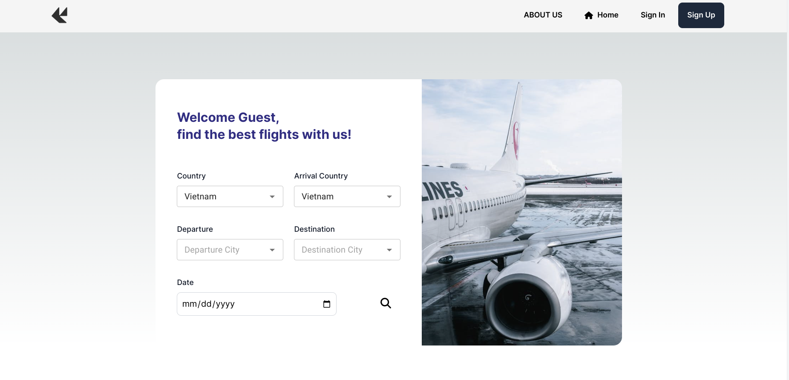
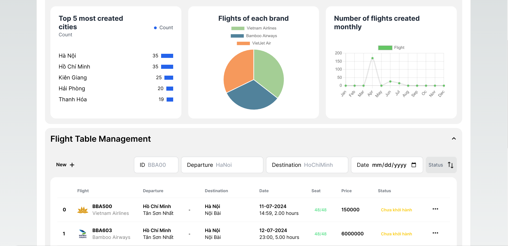
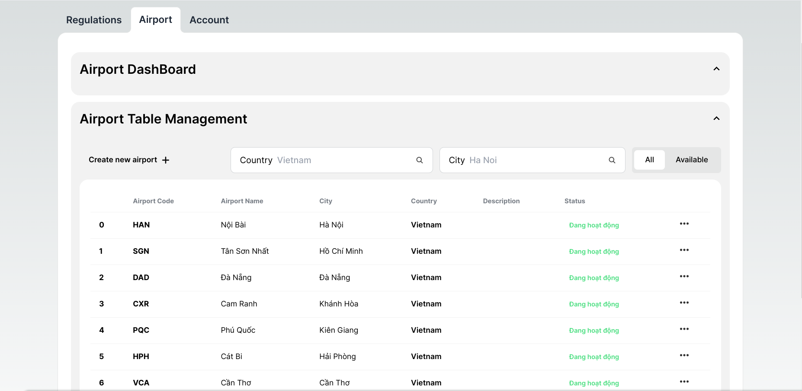
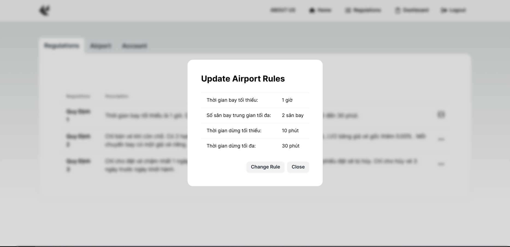
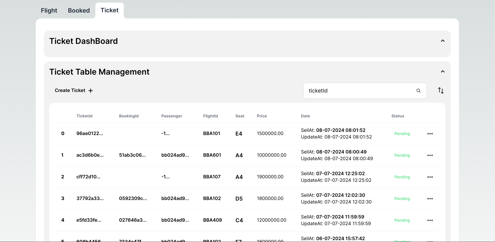
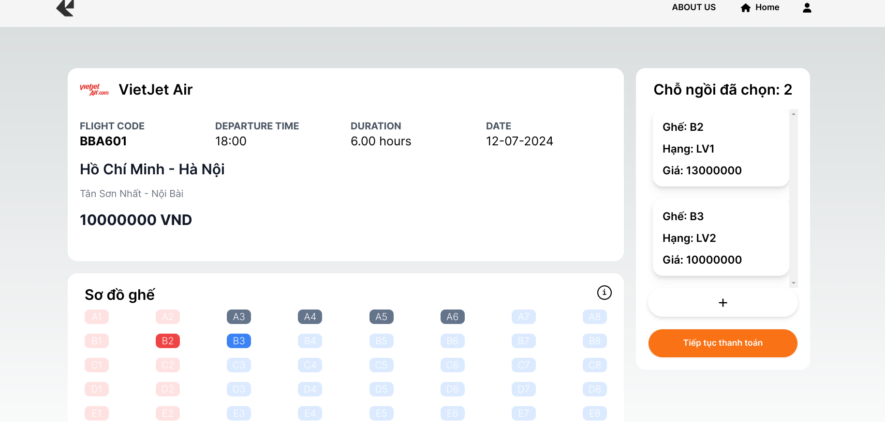
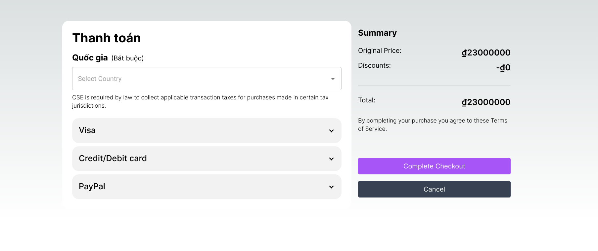
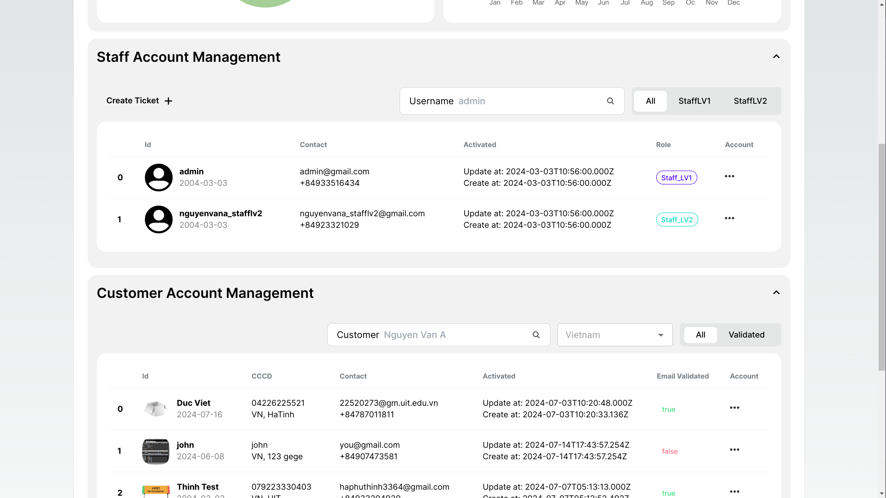

# Airline management frontend - SE104 Project

> Sự phát triển vượt trội của ngành du lịch hàng không trong thời đại ngày nay đã
> đẩy mạnh nhu cầu giải quyết hiệu quả bài toán quản lý các chuyến bay của các
> hãng hàng không cùng với tương tác một cách hiệu quả giữa hãng hàng không
> và khách hàng.Tuy vậy, với mô hình truyền thống việc quản lý số lượng lớn các
> chuyến bay bằng các loại giấy tờ đồng thời việc bán vé cũng phải thông qua
> nhiều thủ tục tiêu tốn số lượng lớn nhân lực, đó là lý do ta cần một hệ thống
> chuẩn hóa các quy trình quản lý bán vé chuyến bay, tránh khỏi những sai sót
> không đáng có.
> Đề xuất xây dựng Website quản lý bán vé máy bay giúp cả khách hàng và
> nhân viên sân bay dễ dàng xem thông tin, mua vé , đặt vé chuyến bay một
> cách khoa học, trực quan, hiện đại, mọi lúc, mọi nơi khi họ có máy tính kết nối
> Internet. Mục tiêu của bài toán là tạo ra một hệ thống phần mềm đáp ứng được
> các yêu cầu sau:

### Quản lý chuyến bay

Hệ thống phải có khả năng quản lý và cập nhật
thông tin về các chuyến bay, bao gồm lịch trình, điểm đến, sân bay, loại máy
bay, và số lượng ghế trống.

### Quản lý sân bay

Hệ thống cho phép nhân viên nhập, sửa thông tin sân bay,
bao gồm tên sân bay, tình trạng sân bay.

### Quản lý các quy định

Cho phép nhân viên có thẩm quyền thay đổi các quy
định về đặt chỗ, giá vé, thời gian bay, thời gian dừng, các hạng vé,...

### Quản lý bán vé

Phần mềm cho phép nhân viên nhập thông tin, tra và in vé khách
hàng.

### Đặt vé, đặt chỗ và thanh toán

Phần mềm phải cho phép khách hàng đặt vé trực tuyến
thông qua giao diện thân thiện và an toàn. Việc thanh toán phải được xử lý một
cách bảo mật và linh hoạt, hỗ trợ nhiều phương thức thanh toán khác nhau.

### Quản lý thông tin hành khách

Hệ thống lưu trữ và quản lý thông tin cá nhân
của hành khách, bao gồm tên, số điện thoại, email và thông tin cá nhân.

# About this repository

Đây là source code frontend của dự án, sử dụng các tech stack sau:

- Web development framework: NextJS (ReactJS based)
- Client - Server Communicate: Restful API
- Backend (ExpressJS) repository: https://github.com/chabuuuu/airlane-management.backend

# About the final product

- Demo (guest user): http://csairs.website/
- Demo (staff user): http://csairs.website/StaffLogin

# About the team

- Hà Phú Thịnh - Backend Developer (Lead team backend)
- Nguyễn Viết Đức - Frontend Developer (Lead team frontend)
- Nguyễn Vũ Khai Tâm - Backend Developer
- Huỳnh Nhật Minh - Frontend Developer
- Đoàn Văn Hoàng - Frontend Developer
